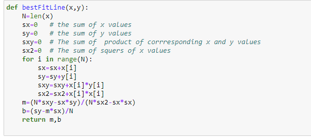

# The-model-of-height-and-weight-of-a-healthy-body

This project is about According to Body Mass Index (BMI) The average weights of healthy bodies for the corresponding heights are given in the following table:

https://www.cancer.org/cancer/risk-prevention/diet-physical-activity/body-weight-and-cancer-risk/adult-bmi.html

The aim is to find a linear regression line for the relationship between height and weight, and a correlation coefficient for this relationship.

find a linear regression line for the relationship between height and weight and a correlation coefficient for this relationship, I  need to collect data on both variables from your sample population. So I used Python function to find the line of best fit in Jupyter.

you can use statistical software or a graphing calculator to calculate the equation of the line of best fit, which will represent the linear relationship between height and weight. Additionally, you can calculate the correlation coefficient, which will tell you the strength and direction of the relationship between the two variables.
